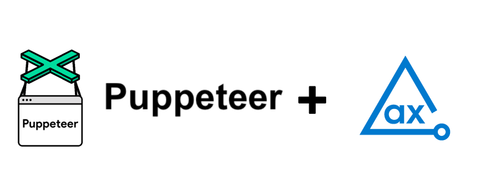

# axe DevTools

[axe DevTools](https://www.deque.com/axe/devtools/) is the most powerful and accurate accessibility toolkit that can get 80% issue coverage—or more—during development. Axe DevTools save money, time, and effort.

Using axe DevTools Puppeteer webdriver binding, you can integrate axe DevTools into your existing testing environment instead of building your testing environment around axe DevTools.


# axe DevTools Puppeteer API Example

This example project demonstrates how axe DevTools Puppeteer detects the accessibility issues and generates reports in CSV, HTML, JSON, and XML formats.

## Prerequisites
- npm
- NodeJS (6.10 or higher)

## Clone Project

Follow these steps to clone and navigate to the directory:
1. Clone example project **`puppeteer_vanilla`** from GitHub.
2. Open the project folder in the code editor.
3. Open the terminal, and then navigate from the project root to the example.

```sh
cd Node/puppeteer_vanilla
```

## Install Dependencies

Install the dependencies **axe DevTools Puppeteer** and **axe DevTools Reporter** for the project.

> **_NOTE:_**
>You need a valid license to access and use our APIs and example projects. For more information, see [Install from Deque’s Agora](https://docs.deque.com/devtools-html/4.0.0/en/node-pu-install-agora) page. After configuring the access to Deque private registry, you can install the dependencies for this project.
The following command installs all the required dependencies **`@axe-devtools/puppeteer`** and **`@axe-devtools/reporter`** as mentioned in the **`package.json`** to run the example project.

```sh
npm install
```

## Run Test File

The **_tests_** directory contains the example test file **`example.spec.js`**. This file shows how to set up the axe DevTools Puppeteer and Reporter APIs, test for accessibility, and generate formatted results.

The following command runs the test files in the **_tests_** directory.

```sh
npm test
```

## Test Results

The test file generates results in the **_a11y-results_** directory. Check each subdirectory for the respective format.

The **`executive-report.html`** file is an executive summary report aggregating results from all scans into one page.

## Configure Test
**`npm test`** runs the **`rimraf`** command mentioned in the **`package.json`**.

```json
  "scripts": {
    "test": "rimraf ./a11y-results && node ./tests/*.spec.js"
  },
```

Every time you run the **`npm test`**, the **`rimraf`** command clears all saved results from the **`a11y-results`** directory, so if you want to retain previous test results, you should remove **`rimraf`** from the **`scripts`** object. 

If you want to modify this project and publish your results in a different folder other than **`./ally-results`**, you should update the directory as intended. 

## Related Information

- [axe DevTools Puppeteer Overview](https://docs.deque.com/devtools-html/4.0.0/en/node-pu-overview)
- [Puppeteer API Reference](https://docs.deque.com/devtools-html/4.0.0/en/node-pu-ref-overview)
- [axe-core Rule Descriptions](https://github.com/dequelabs/axe-core/blob/master/doc/rule-descriptions.md)

 