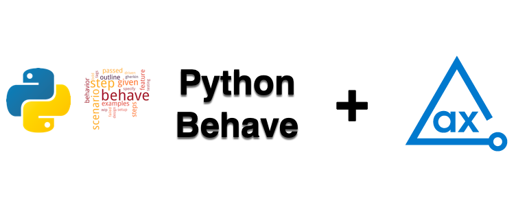

# axe DevTools Python Behave API Example

Using axe DevTools Python Behave, you can integrate axe DevTools into your existing testing environment. This example project demonstrates how axe DevTools Python Behave is used to detect accessibility issues and generates reports in CSV, HTML, JSON, and XML formats.

## Prerequisites

Python 3 (does not support Python 2) along with the virtual environment (venv or pyenv)

## Clone Project

Follow these steps to clone and navigate to the directory:
1. Clone this repo from GitHub.
2. Open the project in your favourite python IDE.
3. Navigate from the root of the repo to this example with the following command:

```sh
cd Python/behave
```

## Binary Reporter

Download the respective [Binary reporter](https://docs.deque.com/devtools-html/4.0.0/en/downloads#binary-reporter) for your operating system and place it in the **_resources_** directory.

## Install Dependencies

Install the dependencies including **axe DevTools API**, **DevTools Behave**, and **DevTools Selenium** for the project.

> **_NOTE:_**
>You need a valid license to use our APIs. For more information, see [Install from Deque’s Agora](https://docs.deque.com/devtools-html/4.0.0/en/py-getting-started) page. After configuring the access to Deque's private registry, you can install the dependencies for this project.

The following command installs all the required dependencies to run this example project.

```sh
pip install -r requirements.txt
```

## Run Tests

The **_features_** directory contains the steps and environment files **`steps.py`** and **`environment.py`** that analyze the page `https://broken-workshop.dequelabs.com/` for accessibility issues.

The following command runs the files in the **_features_** directory.

```sh
behave
```

## Test Results

The tests generate results in the **_a11y-results_** directory if you have placed the respective [Binary reporter](https://docs.deque.com/devtools-html/4.0.0/en/downloads#binary-reporter) for your operating system. Otherwise, they generate only JSON results.

The **`executive-report.html`** file is an executive summary report aggregating results from all scans into one page.

Every time you run **`behave`**, it replaces all previously saved results with the latest results in the **`a11y-results`** directory, so if you want to retain previous test results, you should rename or save them in a different directory. 

If you want to modify this project and publish your results in a folder other than **`./ally-results`**, you should update the output directory in the **`environment.py`** file. 

## Additional Information

- [axe DevTools Python Overview](https://docs.deque.com/devtools-html/4.0.0/en/py-usage-overview)
- [Python API Reference](https://docs.deque.com/devtools-html/4.0.0/en/py-api-behave)
- [axe-core Rule Descriptions](https://github.com/dequelabs/axe-core/blob/master/doc/rule-descriptions.md)

 